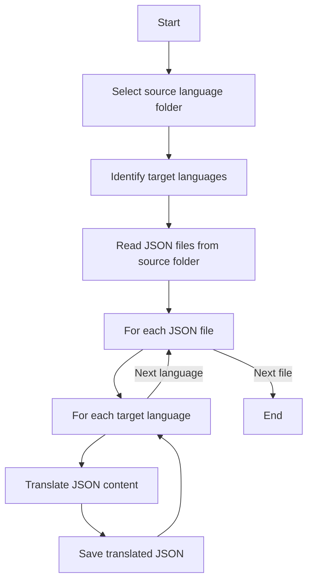

# 🌐 i18n-llm

[](https://goreportcard.com/report/github.com/Martin2037/i18n-llm)
[](https://opensource.org/licenses/MIT)

> AI-Powered Intelligent Internationalization Translation Tool

i18n-llm is a revolutionary command-line tool that leverages advanced artificial intelligence to streamline your internationalization (i18n) workflow. Translate your JSON localization files into multiple languages with just a few simple commands, maintaining high quality and consistency.

## ✨ Key Features

- 🚀 **Fast and Efficient**: Translate multiple files to multiple languages with a single command
- 🧠 **AI-Driven**: Utilizes advanced language models to ensure translation quality
- 🔄 **Structure Preservation**: Perfectly maintains the original JSON structure, translating only the values
- 🌍 **Multi-Language Support**: Supports 20+ common languages
- 💡 **Intelligent Processing**: Automatically skips the source language to avoid unnecessary translations
- 🛠 **Flexible Configuration**: Customize source language, target languages, and directories

## 📁 Directory Structure

i18n-llm expects your project to have the following directory structure:

```
your_project/
│
├── i18n/
│   ├── en/
│   │   ├── common.json
│   │   └── home.json
│   ├── zh/
│   │   ├── common.json
│   │   └── home.json
│   └── ... (other language folders)
```

Each language folder (e.g., `en`, `zh`) should contain JSON files with the same names across all languages.

## 🚀 Installation

### Using Go

```bash
go install github.com/Martin2037/i18n-llm@latest
```

### Using Homebrew (macOS)

```bash
brew tap Martin2037/i18n-llm https://github.com/Martin2037/i18n-llm.git
brew update
brew install i18n
```

## 🔧 Usage

1. Set your OpenAI API key:

```bash
export OPENAI_API_KEY=your_api_key_here
```

2. Navigate to your project directory containing the `i18n` folder.

3. Run the translation command:

```bash
i18n-llm translate -s zh
```

This command will translate all JSON files in the `zh` folder to all supported languages.

### More Examples

Translate to specific languages:
```bash
i18n-llm translate -s en -t fr,de,es
```

Specify a custom i18n directory:
```bash
i18n-llm translate -d /path/to/custom/i18n -s ja
```

## 🔄 Translation Process



## 📘 Complete Usage Example

1. Ensure your project has the correct directory structure (as shown above).

2. Set your OpenAI API key:
   ```bash
   export OPENAI_API_KEY=your_api_key_here
   ```

3. Run the translation command:
   ```bash
   i18n-llm translate -s zh -t en,fr,es -d /path/to/your/i18n
   ```

   This command will:
    - Use `zh` (Chinese) as the source language
    - Translate to `en` (English), `fr` (French), and `es` (Spanish)
    - Look for source files in `/path/to/your/i18n/zh/`
    - Create or update files in `/path/to/your/i18n/en/`, `/path/to/your/i18n/fr/`, and `/path/to/your/i18n/es/`

4. Check the output folders for your translated JSON files.

## 🤝 Contributing

We welcome contributions of all forms! Whether it's new features, bug fixes, or documentation improvements. Check out our [contribution guidelines](CONTRIBUTING.md) to get started.

## 📄 License

i18n-llm is released under the MIT License. See the [LICENSE](LICENSE) file for more details.

## 🙏 Acknowledgements

- Thanks to [OpenAI](https://openai.com/) for providing powerful language model support
- Thanks to [langchaingo](https://github.com/tmc/langchaingo) for the convenient Go language AI interaction interface

---

If you find i18n-llm useful, please consider giving it a star ⭐️!

[Back to Top](#i18n-llm)